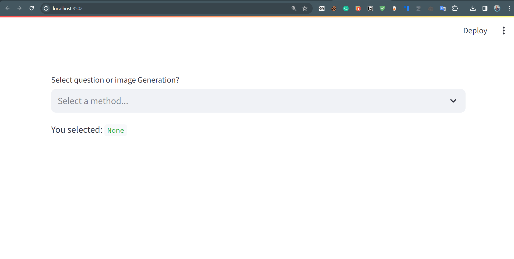
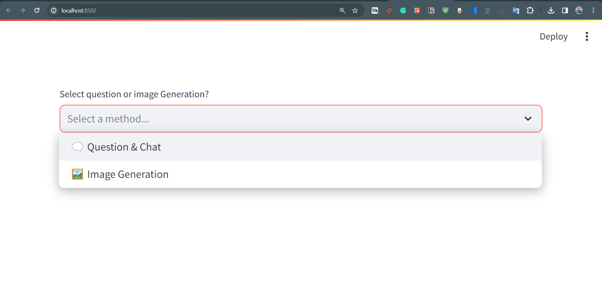
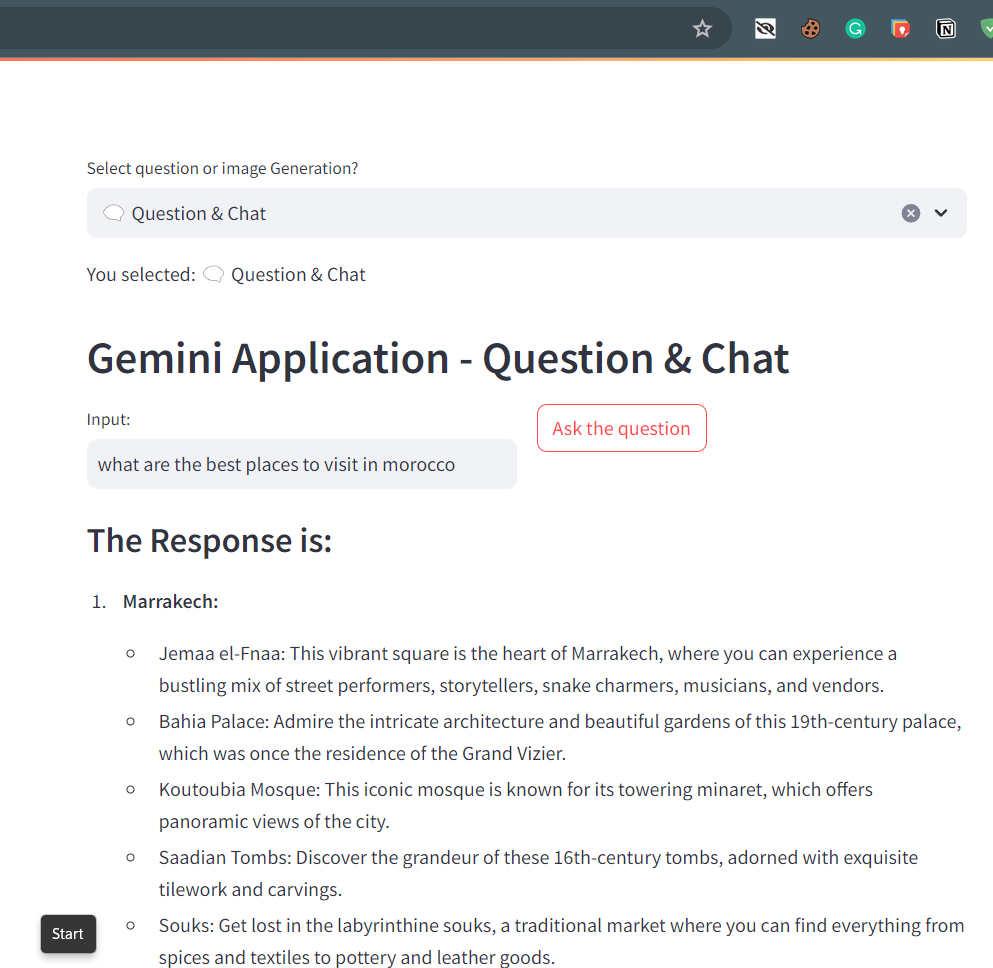
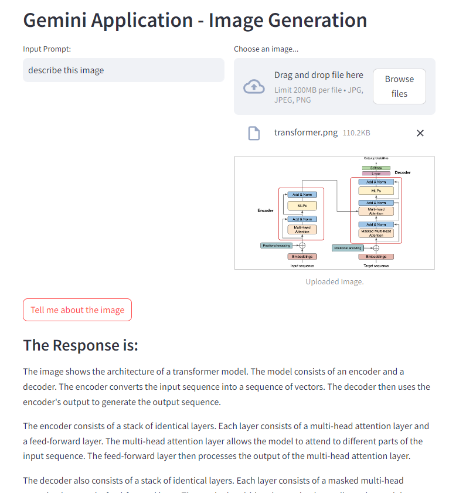

# LMM Project - Gemini Application

## Overview
This project implements a Streamlit web application powered by the Gemini API for both question/chat and image generation. Users can choose between the two options and interact with the Gemini model to receive responses.

## Project Structure

- `main_code.py`: The main Python script containing the Streamlit application.
- `gemini_helper.py`: A separate file containing helper functions for Gemini API interactions.
- `sample_images/`: Directory containing sample images for the README.
- `.env`: Configuration file containing the API key for the Gemini API.

## Screenshots

### Interface


### Select Option


### Question & Chat Section


### Image Generation Section


## Getting Started

1. Clone the repository:

   ```bash
   git clone https://github.com/your-username/lmm-project.git
   cd lmm-project
   ```

2. Install dependencies:
  ```bash
  pip install -r requirements.txt
  ```

3. Run the Streamlit app:   `streamlit run main_code.py`

4. Install dependencies:
   ```bash
   pip install -r requirements.txt
   ```

## Dependencies
[](#)
[](#)
[](#)
[](#)

## Configuration
Ensure you have a valid API key for the Gemini API. You can set it as an environment variable or directly in the `.env` file.
  ```bash
  # .env
  test=your_api_key_here
  ```

## Contributing
Contributions are welcome! Please open an issue or submit a pull request.
